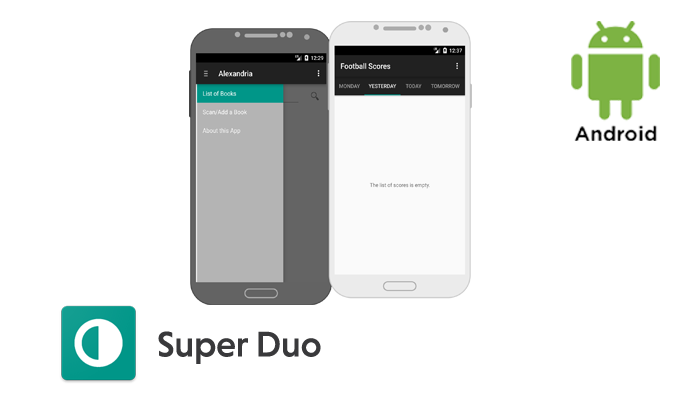

# Udacity Super Duo



## Applications
 * Alexandria
 * Football Scores

## Project description

Added enhancements to two apps in order to make them production ready. The work included ensuring errors were handled gracefully, building a widget for the home screen, support for screen readers, optimizations for localization, and barcode scanning via a library.

[Screenshots](Screenshots/)

## Libraries
 * [Support Design libraries](https://developer.android.com/topic/libraries/support-library/features.html) - Material design library
 * [Realm](https://github.com/realm/realm-java) - Realm is a mobile database: a replacement for SQLite & ORMs
 * [Realm Recyclerview](https://github.com/thorbenprimke/realm-recyclerview) - A RecyclerView that is powered by Realm
 * [Barcode Scanner](https://github.com/dm77/barcodescanner) - Barcode Scanner Libraries for Android
 * [Butter Knife](http://jakewharton.github.io/butterknife/) - UI binding library
 * [Timber](https://github.com/JakeWharton/timber) - Advanced logging library
 * [Dagger 2](http://google.github.io/dagger/) - Dependency Injection library
 * [Retrofit 2](http://square.github.io/retrofit/) - Web API library
 * [RxJava](https://github.com/ReactiveX/RxJava) - Asynchronous and event-based programs library
 * [LeakCanary](https://github.com/square/leakcanary) - A memory leak detection library

 ## Udacity Nanodegree SuperDuo Project

 

  # License - Apache License, Version 2.0

  ```
  # (C) Copyright 2016 by Marek Hakala <hakala.marek@gmail.com>
  # Licensed under the Apache License, Version 2.0 (the "License");
  # you may not use this file except in compliance with the License.
  # You may obtain a copy of the License at
  #
  # http://www.apache.org/licenses/LICENSE-2.0
  #
  # Unless required by applicable law or agreed to in writing, software
  # distributed under the License is distributed on an "AS IS" BASIS,
  # WITHOUT WARRANTIES OR CONDITIONS OF ANY KIND, either express or implied.
  # See the License for the specific language governing permissions and
  #    limitations under the License.
  ```
